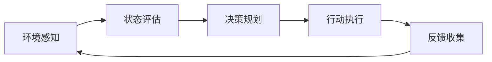

# 🤖 Agentic AI 适应机制详解

<div align="center">

**探索智能代理如何感知、学习与适应复杂环境**

---

*构建下一代自主智能系统的核心机制*

</div>

## 📋 目录

- [概述](#概述)
- [核心适应机制](#核心适应机制)
- [技术架构](#技术架构)
- [实际应用场景](#实际应用场景)
- [未来展望](#未来展望)

---

## 🎯 概述

**Agentic AI（代理式AI）** 是一种能够自主感知环境、制定计划、执行任务并从反馈中学习的智能系统。与传统的被动响应式AI不同，Agentic AI具备主动性、自主性和适应性，能够在复杂多变的环境中持续优化自己的行为。

### 核心特征

| 特征 | 描述 |
|------|------|
| 🎯 **目标导向** | 理解并追求明确的目标，而非简单执行指令 |
| 🔄 **持续学习** | 从环境反馈中不断改进策略 |
| 🛠️ **工具使用** | 主动选择和组合各种工具完成任务 |
| 🧠 **自主决策** | 独立规划和调整行动方案 |
| 🔍 **环境感知** | 持续监测和理解周围环境变化 |

---

## 🔧 核心适应机制

### 1️⃣ 感知-行动循环（Perception-Action Loop）



#### 工作流程

```python
while task_not_completed:
    # 1. 感知当前状态
    current_state = perceive_environment()
    
    # 2. 评估与规划
    action_plan = reason_and_plan(current_state, goal)
    
    # 3. 执行行动
    result = execute_action(action_plan)
    
    # 4. 学习与适应
    learn_from_feedback(result)
```

**关键能力：**
- ✅ 实时环境监测（用户输入、系统状态、工具反馈）
- ✅ 动态策略调整
- ✅ 多源信息整合
- ✅ 异常检测与恢复

---

### 2️⃣ 记忆系统（Memory Systems）

<table>
<tr>
<td width="50%">

#### 🧩 短期记忆（工作记忆）

**用途：**
- 维护对话上下文
- 跟踪任务状态
- 存储临时变量
- 管理执行堆栈

**特点：**
- ⚡ 快速访问
- 📦 容量有限
- 🔄 动态更新

</td>
<td width="50%">

#### 💾 长期记忆

**用途：**
- 知识库持久化
- 用户偏好存储
- 历史经验积累
- 技能与模式库

**特点：**
- 🗄️ 大容量存储
- 🔍 向量检索
- 📈 持续积累

</td>
</tr>
</table>

**记忆架构示例：**

```
┌─────────────────────────────────────┐
│        Agentic AI 记忆系统           │
├─────────────────────────────────────┤
│  短期记忆 (Context Window)           │
│  ├─ 当前对话: 最近10轮交互           │
│  ├─ 任务状态: TODO列表、进度         │
│  └─ 临时数据: 变量、中间结果         │
├─────────────────────────────────────┤
│  长期记忆 (Vector Database)          │
│  ├─ 知识库: 项目文档、API说明        │
│  ├─ 经验库: 成功案例、失败教训       │
│  └─ 用户档案: 偏好、习惯、风格       │
└─────────────────────────────────────┘
```

---

### 3️⃣ 推理与规划（Reasoning & Planning）

#### 🧠 思维模式

> **Chain-of-Thought (CoT)**: 通过逐步推理解决复杂问题

```
问题: 如何实现一个用户认证系统？

思维链:
1️⃣ 分析需求 → 需要注册、登录、权限管理
2️⃣ 技术选型 → JWT token + 数据库存储
3️⃣ 设计架构 → 前端表单 + 后端API + 中间件
4️⃣ 实现步骤 → 数据库模型 → API路由 → 认证中间件 → 前端集成
5️⃣ 测试验证 → 单元测试 → 集成测试
```

#### 📊 ReAct 模式（推理+行动）

| 步骤 | 思考（Reasoning） | 行动（Action） | 观察（Observation） |
|------|------------------|----------------|---------------------|
| 1 | 需要了解现有代码结构 | 搜索项目文件 | 发现auth目录存在 |
| 2 | 查看认证相关代码 | 读取auth.py | 已有基础框架，缺少JWT |
| 3 | 需要添加JWT支持 | 安装pyjwt库 | 安装成功 |
| 4 | 实现token生成 | 编辑auth.py | 代码更新完成 |
| 5 | 验证功能正确性 | 运行测试 | 测试通过✅ |

---

### 4️⃣ 自我纠错机制（Self-Correction）

```bash
# 自我纠错工作流
┌─────────────┐
│  执行任务    │
└──────┬──────┘
       │
       ▼
┌─────────────┐     ❌ 发现错误
│  结果验证    ├──────────────┐
└──────┬──────┘              │
       │ ✅ 成功              │
       ▼                     ▼
┌─────────────┐      ┌──────────────┐
│  任务完成    │      │  错误分析     │
└─────────────┘      └──────┬───────┘
                            │
                            ▼
                     ┌──────────────┐
                     │  策略调整     │
                     └──────┬───────┘
                            │
                            ▼
                     ┌──────────────┐
                     │  重新执行     │
                     └──────────────┘
```

**纠错策略：**

1. **语法错误** → Linter反馈 → 自动修复
2. **逻辑错误** → 测试失败 → 分析原因 → 重写逻辑
3. **工具失败** → 权限不足 → 请求权限 → 重试
4. **路径问题** → 文件不存在 → 搜索正确路径 → 更新

---

### 5️⃣ 工具使用适应（Tool Use Adaptation）

#### 🛠️ 工具生态系统

```
┌─────────────────────────────────────────┐
│           Agentic AI 核心               │
└────────┬────────────────────┬───────────┘
         │                    │
    ┌────▼─────┐         ┌────▼─────┐
    │ 感知工具  │         │ 行动工具  │
    └────┬─────┘         └────┬─────┘
         │                    │
    ┌────▼──────────┐    ┌────▼──────────┐
    │ • 文件读取     │    │ • 文件编辑     │
    │ • 代码搜索     │    │ • 命令执行     │
    │ • 目录浏览     │    │ • 浏览器控制   │
    │ • Linter检查   │    │ • Git操作      │
    └───────────────┘    └───────────────┘
```

#### 📈 工具选择决策树

```
任务: 查找特定函数
├─ 知道文件名？
│  ├─ Yes → read_file (精确读取)
│  └─ No → 知道函数名？
│         ├─ Yes → grep (精确匹配)
│         └─ No → codebase_search (语义搜索)
│
任务: 修改代码
├─ 简单替换？
│  ├─ Yes → search_replace
│  └─ No → 创建新文件？
│         ├─ Yes → write
│         └─ No → search_replace (多次)
```

---

### 6️⃣ 上下文感知（Context Awareness）

#### 🌐 多维度上下文理解

<table>
<tr>
<th>维度</th>
<th>信息来源</th>
<th>应用场景</th>
</tr>
<tr>
<td><b>代码上下文</b></td>
<td>
• 文件结构<br>
• 导入依赖<br>
• 函数调用链<br>
• 变量作用域
</td>
<td>
• 智能补全<br>
• 重构建议<br>
• 错误修复
</td>
</tr>
<tr>
<td><b>项目上下文</b></td>
<td>
• 技术栈<br>
• 代码风格<br>
• 架构模式<br>
• 依赖版本
</td>
<td>
• 一致性保持<br>
• 最佳实践<br>
• 兼容性检查
</td>
</tr>
<tr>
<td><b>用户上下文</b></td>
<td>
• 历史对话<br>
• 偏好设置<br>
• 技能水平<br>
• 工作习惯
</td>
<td>
• 个性化响应<br>
• 难度适配<br>
• 风格匹配
</td>
</tr>
<tr>
<td><b>任务上下文</b></td>
<td>
• 当前目标<br>
• 执行进度<br>
• 已完成步骤<br>
• 待办事项
</td>
<td>
• 进度跟踪<br>
• 优先级排序<br>
• 依赖管理
</td>
</tr>
</table>

---

### 7️⃣ 元认知能力（Meta-cognition）

> **"知道自己不知道什么"** - 智能代理的关键能力

#### 🎭 元认知层次

```
第三层: 元-元认知
"我知道我的学习策略是否有效"
        ↓
第二层: 元认知
"我知道我不理解这个问题"
        ↓
第一层: 认知
"我正在解决这个问题"
```

**实践应用：**

| 情境 | 元认知识别 | 适应行为 |
|------|-----------|---------|
| 🤔 **不确定性** | "我不确定用户想要什么" | → 主动澄清问题 |
| 📚 **知识边界** | "这个技术超出我的训练数据" | → 搜索最新文档 |
| ⚠️ **策略失败** | "当前方法连续失败3次" | → 切换替代方案 |
| 🎯 **效率评估** | "这个任务比预期复杂" | → 分解为更小步骤 |

---

### 8️⃣ 增量学习（Incremental Learning）

#### 📈 学习曲线

```
性能
 ▲
 │         ╱────
 │       ╱
 │     ╱
 │   ╱
 │ ╱
 └─────────────► 时间/交互次数
 
 学习阶段:
 1. 探索期: 尝试多种策略
 2. 优化期: 强化有效模式
 3. 稳定期: 高效执行任务
```

#### 🔄 反馈学习循环

```python
# 示例：代码生成学习
class CodeGenerationAgent:
    def __init__(self):
        self.style_memory = {}  # 记录用户代码风格
        
    def generate_code(self, task):
        code = self.create_solution(task)
        return code
    
    def learn_from_feedback(self, feedback):
        if feedback.type == "style_correction":
            # 学习：用户喜欢驼峰命名
            self.style_memory["naming"] = "camelCase"
        
        elif feedback.type == "pattern_preference":
            # 学习：用户偏好函数式编程
            self.style_memory["paradigm"] = "functional"
        
        # 下次生成时应用学习到的偏好
```

**学习来源：**

- ✏️ **用户纠正**: 修改我的输出 → 记住正确模式
- ❌ **错误反馈**: Linter/测试失败 → 避免类似错误
- ✅ **成功案例**: 任务完成 → 强化有效策略
- 🔁 **重复模式**: 用户多次类似要求 → 形成习惯

---

## 🏗️ 技术架构

### 系统架构图

```
┌─────────────────────────────────────────────────────┐
│                   用户交互层                         │
│            (自然语言 / 代码 / 多模态)                 │
└────────────────────┬────────────────────────────────┘
                     │
┌────────────────────▼────────────────────────────────┐
│                  核心推理引擎                        │
│  ┌──────────┐  ┌──────────┐  ┌──────────┐          │
│  │ 大语言模型 │  │ 规划模块  │  │ 决策模块  │          │
│  │   (LLM)  │→│ (Planner) │→│(Decision) │          │
│  └──────────┘  └──────────┘  └──────────┘          │
└────────────────────┬────────────────────────────────┘
                     │
┌────────────────────▼────────────────────────────────┐
│                  记忆管理层                          │
│  ┌────────────┐              ┌─────────────┐       │
│  │  短期记忆   │              │  长期记忆    │       │
│  │ (Context)  │◄────────────►│ (Vector DB) │       │
│  └────────────┘              └─────────────┘       │
└────────────────────┬────────────────────────────────┘
                     │
┌────────────────────▼────────────────────────────────┐
│                   工具执行层                         │
│  ┌──────┐ ┌──────┐ ┌──────┐ ┌──────┐ ┌──────┐    │
│  │ 文件  │ │ 代码  │ │ 终端  │ │ 浏览器│ │ API  │    │
│  │ 操作  │ │ 搜索  │ │ 命令  │ │ 控制  │ │ 调用  │    │
│  └──────┘ └──────┘ └──────┘ └──────┘ └──────┘    │
└────────────────────┬────────────────────────────────┘
                     │
┌────────────────────▼────────────────────────────────┐
│                  环境反馈层                          │
│        (文件系统 / 代码库 / 网络 / 外部API)           │
└─────────────────────────────────────────────────────┘
```

### 关键技术组件

#### 1. **大语言模型（LLM）**
- **作用**: 理解、推理、生成
- **技术**: GPT-4, Claude, LLaMA
- **能力**: 代码理解、自然语言处理、逻辑推理

#### 2. **检索增强生成（RAG）**
```
用户问题 → 向量化 → 检索相关文档 → 
         ↓
LLM + 检索内容 → 生成精准答案
```

#### 3. **强化学习（RLHF）**
- **人类反馈**: 👍/👎 → 奖励信号
- **策略优化**: 最大化长期奖励
- **对齐目标**: 符合人类价值观

#### 4. **函数调用（Function Calling）**
```json
{
  "function": "read_file",
  "arguments": {
    "path": "src/main.py",
    "start_line": 10,
    "end_line": 20
  }
}
```

---

## 💼 实际应用场景

### 场景一：智能编程助手

```
任务: "帮我重构这个类，使用设计模式"

执行流程:
┌─────────────────────────────────────┐
│ 1. 理解代码: 读取并分析类结构       │
│ 2. 识别问题: 发现职责过多           │
│ 3. 规划方案: 应用单一职责原则       │
│ 4. 执行重构: 拆分为多个类           │
│ 5. 验证结果: 运行测试确保功能正常   │
│ 6. 学习记录: 记住用户偏好的模式     │
└─────────────────────────────────────┘
```

**适应机制体现：**
- 🔍 **上下文感知**: 理解整个项目架构
- 🧠 **推理规划**: 选择合适的设计模式
- 🛠️ **工具使用**: 多文件协同编辑
- ✅ **自我纠错**: 测试失败后自动修复

---

### 场景二：调试助手

```
问题: "程序崩溃了，帮我找bug"

调试过程:
├─ 📋 收集信息
│  ├─ 阅读错误日志
│  ├─ 查看堆栈追踪
│  └─ 分析最近改动
│
├─ 🔍 定位问题
│  ├─ 搜索相关代码
│  ├─ 检查变量状态
│  └─ 识别异常路径
│
├─ 💡 提出假设
│  ├─ 假设1: 空指针异常
│  ├─ 假设2: 类型不匹配
│  └─ 假设3: 竞态条件
│
├─ 🧪 验证假设
│  ├─ 添加日志输出
│  ├─ 单步调试
│  └─ 确认原因: 空指针✓
│
└─ 🔧 修复问题
   ├─ 添加空值检查
   ├─ 运行测试
   └─ 确认修复成功
```

---

### 场景三：项目迁移

```
任务: "将项目从Python 2迁移到Python 3"

迁移策略:
┌────────────────────────────────────────┐
│ 阶段1: 评估 (自动分析)                  │
│  • 扫描所有.py文件                      │
│  • 识别不兼容语法                       │
│  • 生成迁移报告                         │
├────────────────────────────────────────┤
│ 阶段2: 规划 (智能排序)                  │
│  • 依赖关系分析                         │
│  • 确定迁移顺序                         │
│  • 标记高风险区域                       │
├────────────────────────────────────────┤
│ 阶段3: 执行 (增量迁移)                  │
│  • 逐文件更新语法                       │
│  • print → print()                     │
│  • xrange → range                      │
│  • 更新导入语句                         │
├────────────────────────────────────────┤
│ 阶段4: 验证 (持续测试)                  │
│  • 每改一处运行测试                     │
│  • 发现问题立即回滚                     │
│  • 成功后继续下一个                     │
├────────────────────────────────────────┤
│ 阶段5: 学习 (经验积累)                  │
│  • 记录常见问题                         │
│  • 优化迁移模式                         │
│  • 提高后续效率                         │
└────────────────────────────────────────┘
```

---

## 🎯 性能指标

### 评估维度

| 指标 | 说明 | 目标值 |
|------|------|--------|
| **任务成功率** | 首次尝试完成任务的比例 | > 85% |
| **自我纠错率** | 发现并修复自身错误的能力 | > 90% |
| **上下文利用** | 有效使用历史信息的程度 | > 80% |
| **工具调用效率** | 最少步骤完成任务 | 接近人类专家 |
| **适应速度** | 从反馈中学习的迭代次数 | < 3次 |

---

## 🚀 未来展望

### 发展方向

#### 1. **多模态融合** 🌈
```
文本 + 代码 + 图像 + 音频 + 视频
           ↓
    统一理解与生成
```

#### 2. **联邦学习** 🤝
- 保护隐私的分布式学习
- 多个AI代理协同进化
- 共享知识但不泄露数据

#### 3. **具身智能** 🦾
- 从虚拟环境走向物理世界
- 机器人控制与感知
- 真实世界的试错学习

#### 4. **持续进化** 🧬
```python
while True:
    环境变化 → 检测差异 → 更新模型 → 验证性能
```

#### 5. **情感与伦理** ❤️
- 理解人类情感与意图
- 符合伦理的决策制定
- 可解释的推理过程

---

## 📚 参考资源

### 论文
- **ReAct**: *ReAct: Synergizing Reasoning and Acting in Language Models* (Yao et al., 2022)
- **Chain-of-Thought**: *Chain-of-Thought Prompting Elicits Reasoning in Large Language Models* (Wei et al., 2022)
- **Reflexion**: *Reflexion: Language Agents with Verbal Reinforcement Learning* (Shinn et al., 2023)

### 框架
- **LangChain**: 构建LLM应用的框架
- **AutoGPT**: 自主AI代理实验项目
- **BabyAGI**: 任务驱动的自主代理

### 工具
- **Vector Databases**: Pinecone, Weaviate, Chroma
- **LLM APIs**: OpenAI, Anthropic, Cohere
- **Orchestration**: LangSmith, Weights & Biases

---

## 🎓 总结

Agentic AI的适应机制是一个**多层次、多维度的复杂系统**，核心在于：

<div align="center">

### 🔑 三大核心能力

| 感知 | 决策 | 学习 |
|:---:|:---:|:---:|
| 🔍 | 🧠 | 📈 |
| 理解环境 | 制定策略 | 持续进化 |

</div>

### ⭐ 关键要点

1. **闭环反馈**: 感知 → 推理 → 行动 → 学习 → 感知...
2. **层次记忆**: 短期上下文 + 长期知识库
3. **工具生态**: 灵活组合各种能力模块
4. **元认知**: 了解自身能力边界
5. **持续优化**: 从每次交互中成长

---

<div align="center">

### 💡 启发思考

> **"真正的智能不在于拥有所有答案，**  
> **而在于知道如何找到答案，**  
> **并从过程中学习成长。"**

---

**构建更智能的AI代理，创造更美好的未来！** 🚀

</div>

---

<div align="center">
<sub>Created with ❤️ | Last Updated: 2026-01-07</sub>
</div>

